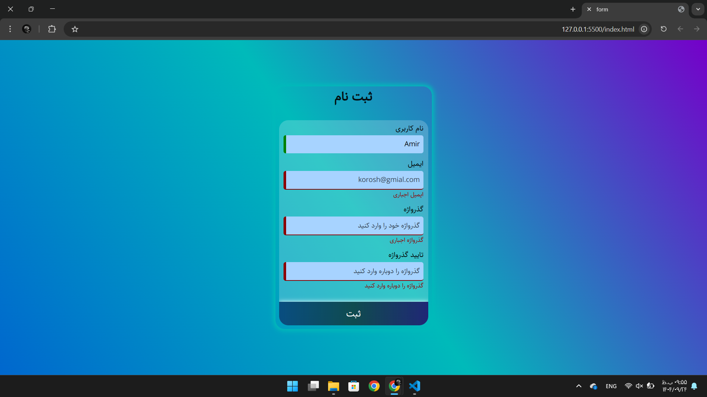

# 📝 Client-Side Signup Form Project

## 📌 About the Project

This is a **simple and elegant signup form** in Persian (RTL) built with **pure HTML, CSS, and JavaScript** (no external frameworks or libraries).

The form includes the following fields:

- Username
- Email
- Password
- Confirm Password

**Client-side validation** is performed (after clicking the submit button), providing **instant visual feedback** to the user (error or success).

---

## 📸 Screenshot

| Sceenshot                               |
| --------------------------------------- |
|  |

---

## ✨ Key Features

- **Responsive** design for mobile and desktop
- Local **Sahel font** integration
- Full field validation
- Beautiful visual effects with **gradients and shadows**
- Prevents form submission if errors exist

---

## ⚡ Tech Stack

- **HTML5** – Page and form structure
- **CSS3** – Flexbox, gradients, media queries, custom font
- **Vanilla JavaScript** – Client-side validation logic

---

## 📂 File Structure

```bash
textproject-folder/
├── index.html     → Main page and form structure
├── style.css      → Full styling and responsive design
├── main.js        → Client-side validation logic with vanilla JS
└── font/
    ├── Sahel.woff
    └── Sahel.woff2   → Persian Sahel font
```

---

## 🚀 How to Run

Place all files in a single folder (maintain the font folder structure).

Open index.html in your browser.

Test the form – if there are errors, appropriate messages will be displayed, and submission will be blocked.

---

## 👨‍💻 Author

Amir Nouaparast  
GitHub: [Amir Nouaparast](https://github.com/AmirNouaparast)  
Frontend Developer | Vanilla JS Enthusiast | Clean Code Lover ☕
